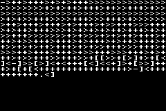

# ARMfuck
ARMfuck shows that ARM's `LDM` and `STM` instructions are Turing-complete by using them, and no other instructions, to implement an interpreter for a version of a Brainfuck. For more information on how it works, read [this blog post](https://kellanclark.github.io/2023/09/18/armfuck/).



---

## Using
This repository comes provided with a compiled ROM that has `quine.bf` (the program running in the image) loaded. To load a new Brainfuck program or change the input, it must be converted into a form the interpreter can understand and inserted into the ROM by running
```bash
python scripts/loadprogram.py <brainfuck file> [input text]
```

Once you've selected a program, you can run `armfuck.gba` on a Game Boy Advance emulator of your choice or use a flashcart to run it on a real system.

---

## Compiling
The base ROM can be compiled with the included FASMARM using the command
```shell
.\FASMARM\fasmarm.exe header.s armfuck.gba
python .\scripts\unoptimize.py armfuck.gba
```
on Windows or
```bash
./FASMARM/fasmarm header.s armfuck.gba
python scripts/unoptimize.py armfuck.gba
```
on Linux.

If you intend to run or test on the mGBA emulator, you must add `-d MGBA=1` or it won't be detected as a valid ROM.

Changes to certain parts of the header additionally require you to run
```bash
python scripts/headercompliment.py armfuck.gba
```
or modify the header compliment value in `header.s`.
